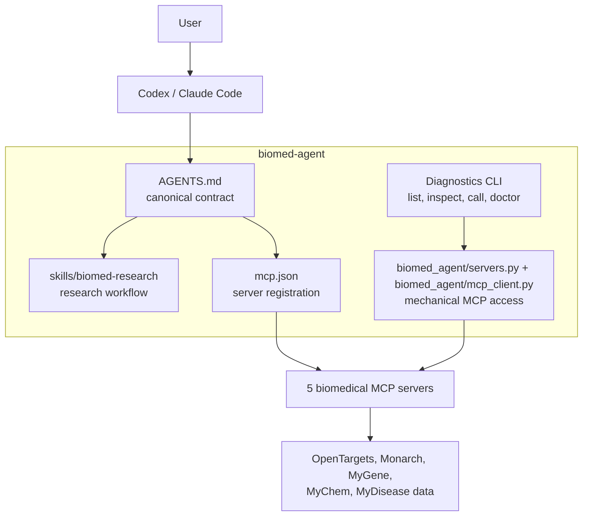

# Biomedical Agent Workspace

Agent-native biomedical research workspace for Claude Code and Codex, backed by MCP tools instead of app-owned LLM APIs.

This repo no longer owns an LLM reasoning loop or Streamlit UI. Codex or Claude Code should call the five biomedical MCP servers directly, guided by [AGENTS.md](AGENTS.md) and [skills/biomed-research/SKILL.md](skills/biomed-research/SKILL.md).

## What Stays Here

- MCP server registry and local path handling.
- A tiny diagnostics CLI for server/tool inspection.
- The cross-server research contract for agents.
- Example MCP registration in [mcp.json](mcp.json).

## Architecture



## MCP Servers

The default setup expects sibling repos:

- `../opentargets-mcp`
- `../monarch-mcp`
- `../mygene-mcp`
- `../mychem-mcp`
- `../mydisease-mcp`

Override paths with `OPENTARGETS_MCP_PATH`, `MONARCH_MCP_PATH`, `MYGENE_MCP_PATH`, `MYCHEM_MCP_PATH`, or `MYDISEASE_MCP_PATH`.

## Setup

```bash
uv sync
```

## Install From Git

```bash
uvx --from git+https://github.com/nickzren/biomed-agent biomed-agent doctor
```

`doctor` needs the MCP repos at the expected sibling paths or matching `*_MCP_PATH` environment variables.

## Diagnostics

```bash
uv run biomed-agent list-servers
uv run biomed-agent list-servers --json
uv run biomed-agent list-tools
uv run biomed-agent list-tools --json
uv run biomed-agent list-tools --server opentargets
uv run biomed-agent call-tool opentargets.search_entities '{"query_string":"BRAF","entity_names":["target"]}'
uv run biomed-agent doctor
uv run biomed-agent doctor --json
```

## Init Config

`init` is print-only. It does not edit Codex, Claude Code, or Cursor settings.

```bash
uv run biomed-agent init --runtime codex --print
uv run biomed-agent init --runtime claude --print
uv run biomed-agent init --runtime cursor --print
uv run biomed-agent init --runtime codex --print --mcp-base ../
```

## Tests

```bash
uv run pytest tests/ -q
```

## Safety

Research and educational use only. This is not a clinical decision system and must not provide diagnosis, prescribing, dosing, or patient-specific treatment advice.
