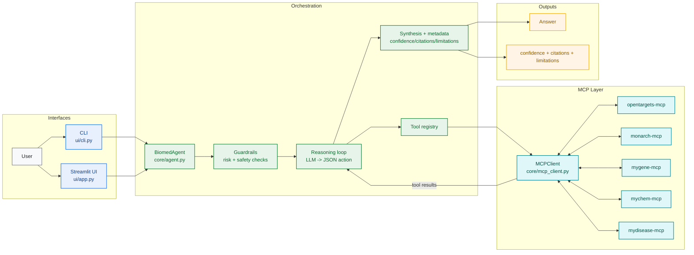

# Biomedical Agent

[](https://www.python.org/)
[](ui/app.py)
[](https://github.com/modelcontextprotocol)
[](LICENSE)

General-purpose biomedical knowledge assistant that connects to multiple MCP biomedical data sources and synthesizes answers with confidence, citations, and limitations.

## What It Does

- Connects to biomedical MCP servers (OpenTargets, Monarch, MyGene, MyChem, MyDisease)
- Routes questions across tools and returns synthesized answers
- Returns structured metadata for trust:
  - `confidence` (`high|medium|low`)
  - `citations` (observation ID + tool)
  - `limitations` (missing evidence, conflicts, uncertainty)
- Supports both CLI and Streamlit interfaces

## Architecture



### Query Lifecycle

```mermaid
%%{init: {'flowchart': {'curve': 'linear', 'nodeSpacing': 35, 'rankSpacing': 45}}}%%
flowchart LR
    classDef input fill:#E8F0FE,stroke:#1A73E8,color:#0B3D91,stroke-width:1.2px;
    classDef retrieve fill:#E6F4EA,stroke:#188038,color:#0D652D,stroke-width:1.2px;
    classDef output fill:#FFF4E5,stroke:#F9AB00,color:#8D5B00,stroke-width:1.2px;

    Q["1. User question"] --> R["2. Risk/safety check"]
    R --> T["3. Select tools"]
    T --> C["4. Execute MCP calls"]
    C --> O["5. Normalize observations"]
    O --> A["6. Compose answer"]
    A --> M["7. Add metadata<br/>confidence + citations + limitations"]
    M --> X["8. Return response to CLI/UI"]

    class Q,R input
    class T,C,O,A retrieve
    class M,X output
```



## Safety Scope

- Intended for research and educational use.
- Not a clinical decision system.
- Does not provide personalized diagnosis or treatment advice.

## Prerequisites

- Python 3.12 or 3.13
- `uv` for dependency management
- MCP servers installed locally:
  - [opentargets-mcp](https://github.com/nickzren/opentargets-mcp)
  - [monarch-mcp](https://github.com/nickzren/monarch-mcp)
  - [mygene-mcp](https://github.com/nickzren/mygene-mcp)
  - [mychem-mcp](https://github.com/nickzren/mychem-mcp)
  - [mydisease-mcp](https://github.com/nickzren/mydisease-mcp)

## Setup

1. Install dependencies:
```bash
uv sync
```

2. Configure environment variables:
```bash
cp .env.example .env
```

3. Edit `.env` with your API key and local MCP server paths.

## CLI Usage

List server availability:
```bash
uv run python -m ui.cli list-servers
```

List tools:
```bash
uv run python -m ui.cli list-tools
uv run python -m ui.cli list-tools --server opentargets --server mychem
uv run python -m ui.cli list-tools --capability drug
```

Run a biomedical query:
```bash
uv run python -m ui.cli query "What is the mechanism of action of vemurafenib?"
```

Run a query and show trace:
```bash
uv run python -m ui.cli query "Which genes are associated with Parkinson disease?" --show-steps
```

Run a query and output full JSON:
```bash
uv run python -m ui.cli query "What drugs target BRAF?" --json
```

Call one tool directly:
```bash
uv run python -m ui.cli call-tool opentargets.search_entities '{"query_string": "BRAF", "entity_names": ["target"]}'
```

Interactive chat:
```bash
uv run python -m ui.cli chat
```

## Streamlit Usage

```bash
uv run streamlit run ui/app.py
```

Then:
1. Select available servers in the sidebar.
2. Click Connect.
3. Ask questions in Chat or Direct Query.
4. Inspect Sources and Limitations in each response.
